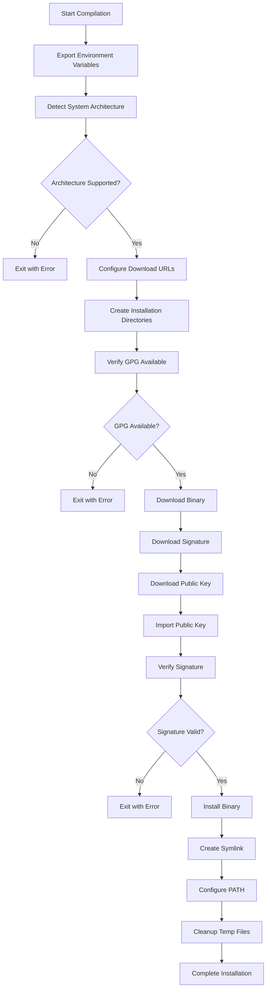

# Heroku AppLink Service Mesh Buildpack Architecture

## Overview

The Heroku AppLink Service Mesh Buildpack is a specialized buildpack that downloads, verifies, and installs the Heroku AppLink Service Mesh binary during application deployment. This buildpack acts as a sidecar installer that enables service mesh capabilities for applications running on Heroku.

## Core Architecture

### Buildpack Structure

```
heroku-buildpack-heroku-applink-service-mesh/
├── bin/
│   ├── detect          # Detection script (always succeeds)
│   ├── compile         # Main installation logic (Heroku V2 buildpacks)
│   └── build           # CNB-compatible build script
├── buildpack.toml      # Buildpack metadata and configuration
└── README.md          # Usage documentation
```

### Buildpack Flow

The buildpack supports both traditional Heroku buildpacks (V2) and Cloud Native Buildpacks (CNB):

#### Traditional Heroku Buildpack Flow
1. **Detection Phase** (`detect`): Always returns success (exit 0)
2. **Compilation Phase** (`compile`): Downloads and installs the service mesh binary

#### Cloud Native Buildpack Flow
1. **Build Phase** (`build`): 
   - Creates CNB layer structure
   - Delegates to `compile` script
   - Configures process launch commands

## Component Architecture

### 1. Detection Component (`bin/detect`)

**Purpose**: Determine if the buildpack should run
**Implementation**: Always returns success (exit 0)
**Rationale**: This buildpack is intended to be explicitly added by developers, so it always runs when present

### 2. Core Installation Component (`bin/compile`)

**Purpose**: Download, verify, and install the Heroku AppLink Service Mesh binary

#### Architecture Flow:



#### Key Features:

**Architecture Detection**:
- Supports `x86_64` (amd64) and `aarch64` (arm64)
- Fails fast on unsupported architectures

**Security**:
- GPG signature verification for all downloaded binaries
- Uses separate signature files (`.asc`) and public key verification
- Fails if GPG is not available on the stack

**Download Strategy**:
- Downloads from configurable S3 bucket
- Supports version selection via environment variables
- Uses versioned binary naming: `heroku-applink-service-mesh-{version}-{arch}`

**Installation Strategy**:
- Installs to `vendor/heroku-applink/bin/` directory
- Creates symlink with well-known name for easier Procfile configuration
- Adds binary directory to PATH via `.profile.d` script

### 3. CNB Support Component (`bin/build`)

**Purpose**: Provide Cloud Native Buildpack compatibility

#### Features:
- Creates CNB layer metadata structure
- Automatically wraps web processes with service mesh
- Reads and modifies Procfile commands
- Generates launch configuration

## Configuration Architecture

### Environment Variables

| Variable | Purpose | Default |
|----------|---------|---------|
| `HEROKU_APPLINK_SERVICE_MESH_RELEASE_VERSION` | Specify binary version | `latest` |
| `HEROKU_APPLINK_SERVICE_MESH_S3_BUCKET` | Override S3 bucket | `heroku-applink-service-mesh-binaries` |

### File System Layout

**Build Time**:
```
/app/
├── vendor/heroku-applink/bin/
│   ├── heroku-applink-service-mesh-{version}-{arch}  # Actual binary
│   └── heroku-applink-service-mesh                   # Symlink
└── .profile.d/
    └── heroku-applink-service-mesh-{version}-{arch}.sh  # PATH setup
```

**Runtime**:
- Binary available at `/app/vendor/heroku-applink/bin/heroku-applink-service-mesh`
- Included in system PATH for easy Procfile usage

## Security Architecture

### Download Security
1. **HTTPS Transport**: All downloads use HTTPS
2. **GPG Verification**: Every binary is cryptographically verified
3. **Public Key Management**: Public keys downloaded from trusted source
4. **Fail-Safe**: Installation fails if any security check fails

### Runtime Security
- Binary runs with application user permissions
- No elevated privileges required
- Mesh operates as application wrapper/proxy

## Integration Architecture

### Heroku Platform Integration
- Compatible with all Heroku stacks that include GPG
- Integrates with Heroku AppLink add-on ecosystem
- Uses standard buildpack conventions and APIs

### Application Integration
```
Original:  web: node server.js
Modified:  web: heroku-applink-service-mesh node server.js
```

The service mesh binary acts as a transparent proxy, wrapping the original application command.

### Cloud Native Buildpack Integration
- Implements CNB specification
- Creates proper layer metadata
- Automatically configures process launch commands
- Compatible with Cloud Native platforms

## Operational Architecture

### Deployment Flow
1. Developer adds buildpack to application
2. Buildpack runs during slug compilation
3. Binary downloaded and installed in slug
4. Application deployed with service mesh capabilities
5. Runtime: Service mesh wraps application processes

### Monitoring and Observability
- Installation logs provide deployment visibility
- Binary verification status logged
- Runtime behavior handled by service mesh binary itself

### Error Handling
- Graceful failure on unsupported architectures
- Clear error messages for missing dependencies
- Signature verification failures prevent deployment
- Network issues during download cause build failure

## Performance Considerations

### Build Time Performance
- Single binary download per architecture
- Parallel download of binary, signature, and public key
- Minimal file system operations
- Cleanup of temporary files

### Runtime Performance
- Zero overhead during application startup (binary already installed)
- Service mesh performance depends on mesh binary implementation
- No buildpack overhead at runtime

## Extensibility

### Version Management
- Configurable version selection
- Support for `latest` and specific version tags
- Version information preserved in installation metadata

### Architecture Support
- Designed for easy addition of new architectures
- Architecture detection isolated to single function
- Architecture-specific binary naming convention

### Configuration Extension
- Environment variable based configuration
- S3 bucket and URL structure configurable
- Profile script generation supports customization

## Dependencies

### Build Dependencies
- `curl` - Binary downloads
- `gpg` - Signature verification
- `bash` - Script execution
- Standard Unix utilities (`sed`, `grep`, `ln`, etc.)

### Runtime Dependencies
- None (binary is statically linked)

## Compliance and Standards

### Buildpack Standards
- Follows Heroku buildpack conventions
- Implements Cloud Native Buildpack specification
- Uses standard exit codes and logging formats

### Security Standards
- GPG signature verification
- HTTPS-only downloads
- No credentials stored in buildpack
- Fail-safe security model

---

This architecture enables secure, automated installation of the Heroku AppLink Service Mesh while maintaining compatibility with both traditional Heroku and Cloud Native buildpack ecosystems.
